# Testing

## Bugs Found

1. **Profile Element Being Pushed To Left On Large Screens** - *Fix:* Testing showed that the *navbar-expand-lg* bootstrap class was changing the navbar elements to flex on large screens which messed up the profile position. Removing the class fixed the issue.
2. **DataTables Not Resizing Correctly** - *Fix:* Remove *class="col"* attributes from *th* elements in datatables.
3. **Cards Stacking On Top Due To Height Constraint** - *Fix:* Add margin bottom and use calc function to calculate height instead.
4. **Steps Up and Down Buttons Not Behaving Properly On Row Delete** - *Fix:* TBC
5. **Steps Up and Down Buttons Not Being Disabled On Edit Page** - *Fix:* This was due to the fact that the rows were generated by django, not the js script so the script to disable the appropriate buttons wasn't running. I created a document ready function that performed the action again.
6. **Some Users Not Able to Create Jobs** - *Fix:* TBC
7. **Extending User Model To Include Custom Fields Not Saving Correctly** - *Fix:* Create custom save method on the custom all-auth signup form to process fields and create an instance of the *UserProfile* model
8. **Circular Import In Assets Models File Due To Interdependancy of Models** - *Fix:* The *Job* model has a foreign key to the *Assets* model, the *PPM* model has a foreign key relationship to the *Assets* and *Jobs* models. Having the *Assets* model and *PPM* models in the same *models.py* file was giving a circular import due to the relationships between the models. As such I had to segregate the models into two seperate files in the *submodels* directory to prevent the circular import error.
9. **Tables overflowing horizontally in details pages on mobile views** - *Fix:* Add *table-responsive-sm* class to tables
10. **Not Able To Accurately Record Which Jobs Are PPM's** - *Fix:* Change PPM model structure to be a job template.
11. **Repetitive Templating** - *Fix:* Create base templates for different template structures
12. **Unnecessary POST Handlers** - *Fix:* Some views call an instance of a form just to set an initial parameter but get passed to a different view as the POST form handler, as such, having POST handlers on the initial views was unneccessary
13. **No Margin Beneath Buttons On Details Pages** - *Fix:* Add bottom padding to main element
14. **Allowed To Withdraw Stock When Not Enough Available** - *Fix:* Add custom clean method to transfers form to check the current stock before validating the form.
15. **int object has no attribute microseconds** - *Fix:* When creating a new project I ran an error that was trying to get the attribute microseconds of an integer. I discovered that in one of my aggregate functions, I was trying to find the average time. If no times are recorded then it is treated as zero. I then wanted to take the microseconds attribute off the average time which is what caused the error. I added a check to see if the average time was a time delta object before the operation is performed.

## Outstanding Bugs

### Datatables Not Resizing Correctly On Screen Resize

[Datatables](https://datatables.net/) is a JS/CSS api for creating datatables with responsive resizing, search functionalities, ordering buttons, pagination and many other features. It is an excellent library. However, a bug I found when using it was that the datatable underwent a large screen resize, the responsiveness of the datatables would break and cause the table to overflow out of it's divider or not fill it's container completely. Upon refreshing the page at the current screen width, the datatables behave as expected. You can see examples of what I mean below.

#### Normal Behaviour

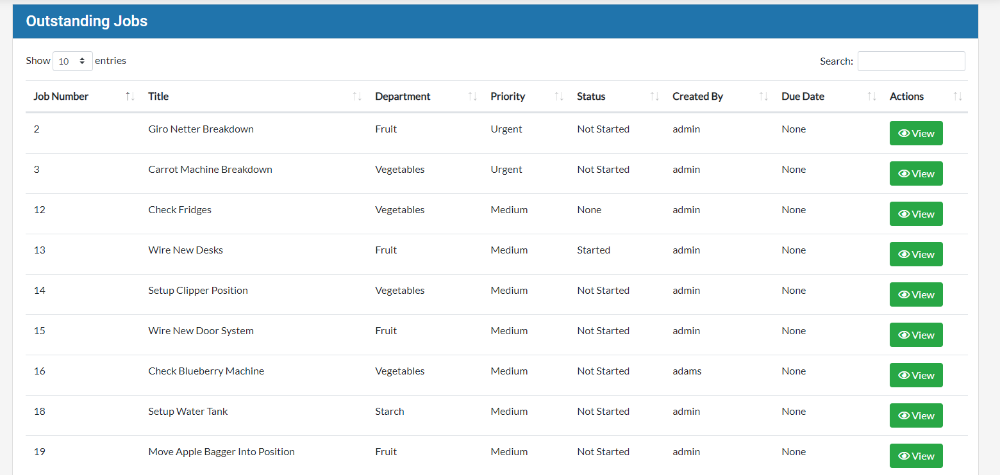

#### Not Filling Div On Screen Resize - Small To Big

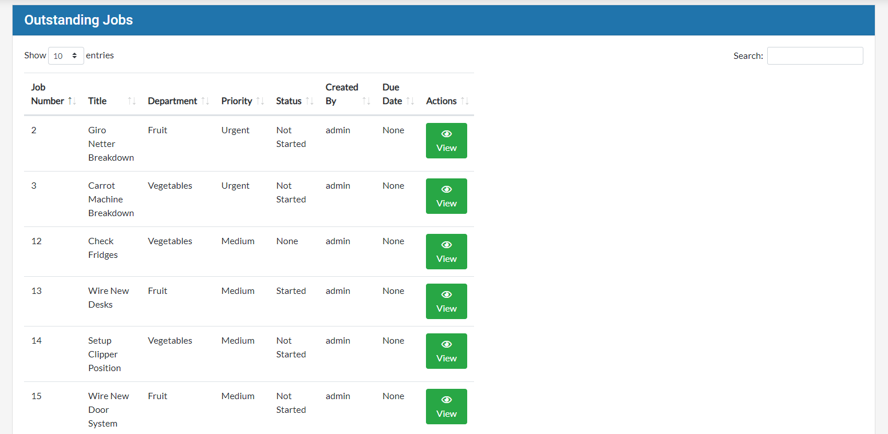

#### Overflowing Div On Screen Resize - Big To Small

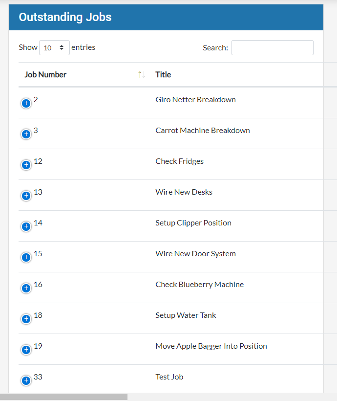

I struggled to find a solution to fix this problem. Adding CSS style rules to the table/container accomplished nothing as the *Datatables* library overrides them. I scoured the datatables documentation for fixes but came up empty. I tried the following datatables functions, [responsive.recalc()](https://datatables.net/reference/api/responsive.recalc()) and [columns.adjust()](https://datatables.net/reference/api/columns.adjust()) but neither of them fixed the problem.

One thing that did work was using a JS script to automatically refresh the page on screen resize however after discussing this fix with my mentor he suggested removing this as it was bad UX design to force a page reload on a screen resize. We worked together to try and find a solution to the issue but came up short and decided that screen resizes are not natural browser behaviours and that as long as it was responsive on mobile and desktop when the page is initially loaded then it is responsive. I agreed and removed it and decided instead to document the bug in the documentation as proof of my attempts to fix the issue.

To be clear, the tables are responsive on all screen sizes and the tables resize correctly on small resizes, mobile portrait to mobile landscape for example, however on some large screen resizes the datatables may not behave properly by either not filling their div or overflowing it. This can be amended by a page reload.

## Lighthouse Testing

Using the *Chrome Dev Tools*, I generated lighthouse reports for different sections of the site to evaluate responsiveness, performance and find any issues the site may have. The Lighthouse testing was conducted on the [deployed](https://meade-pallas.herokuapp.com/) version of the site.

### Home Page

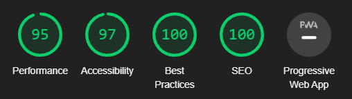

**SEO: Site Didn't Have *Meta* Description** - *Fix:* Add *Meta* description to base template header.

### Dashboard Page

**Performance: Eliminate render-blocking resoures** - The biggest issue holding the back was the loading of the external Bootstrap files which I couldn't really do anything about because they are needed by the site so I couldn't fix it.

### Jobs Page

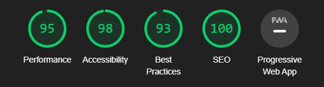

### Job Details Page

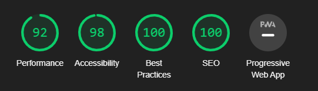

### Create Job Form Page

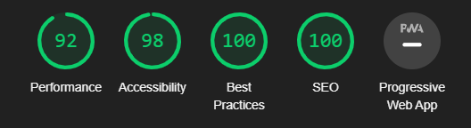

### Notifications Page

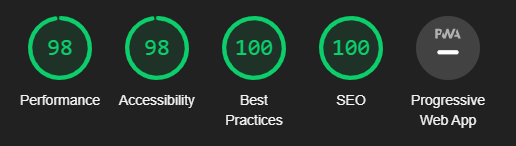

**Bug: Table Not Responsive On Small Screens**  - *Fix:* Not Lighthouse specific but I noticed the notifications table slighthly overflowed on very small screens. I added table responsive sm class to table

### Staff Detail Page

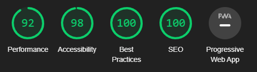

### Receive Stock Page

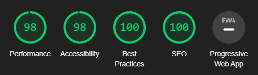

### Project Details Page

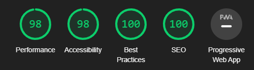

### Sign Up Form

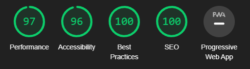

I was pretty happy with the lighthouse results, there were only minor issues on most of the pages with easy fixes and I was satisfied that the scores were all high enough.

## Manual Testing

Manual testing was conducted to verify that all features, functionalities, buttons and forms performed the intended actions without any major problems or internal server errors.

### Sign Up Form Testing

#### Sign Up Test Procedure

1. Navigate to sign up form
2. Fill in form details using temporary email address from [Temp Mail](https://temp-mail.org/en/). Try using invalid responses to check that form doesn't allow blank fields
3. Submit form
4. Check temporary mailbox for verification email
5. Click link in email to verify account
6. Sign in with account to verify the account is working properly

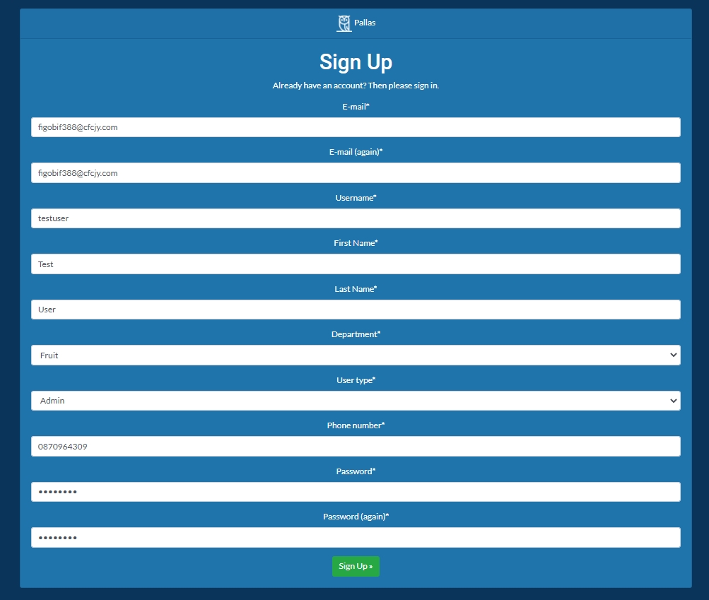

#### Sign Up Test Outcome

Using an invalid email address for the email field wouldn't let me submit it as intended.

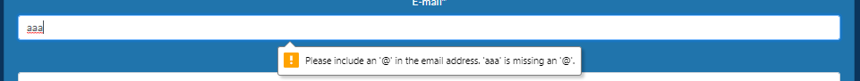

Trying to sign up with a username that already exists also failed as should be the case.

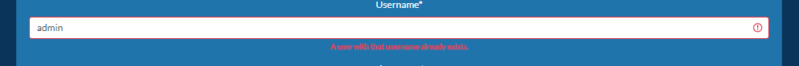

Trying to create an account with too simple a password like *abc123* failed too which is appropriate.

Upon submitting a valid form, the site notifies the user to verify their email address.

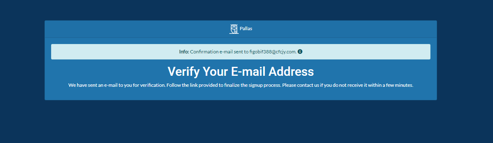

The email was sent successfully, however, I did notice that the email contained an invalid link to the site of *pallas.example.com*.

**Fix:** I logged into the admin center and changed the site entry to *meade-pallas.herokuapp.com* to fix this.

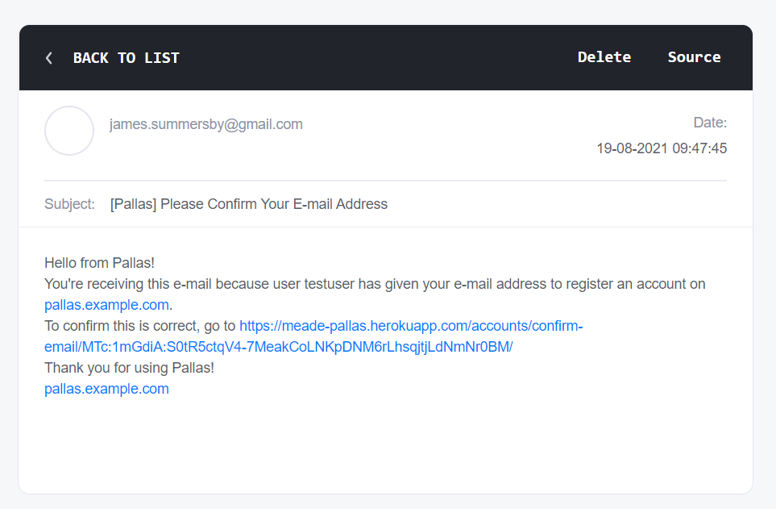

Upon clicking the verification link, I was prompted to confirm my email as expected.

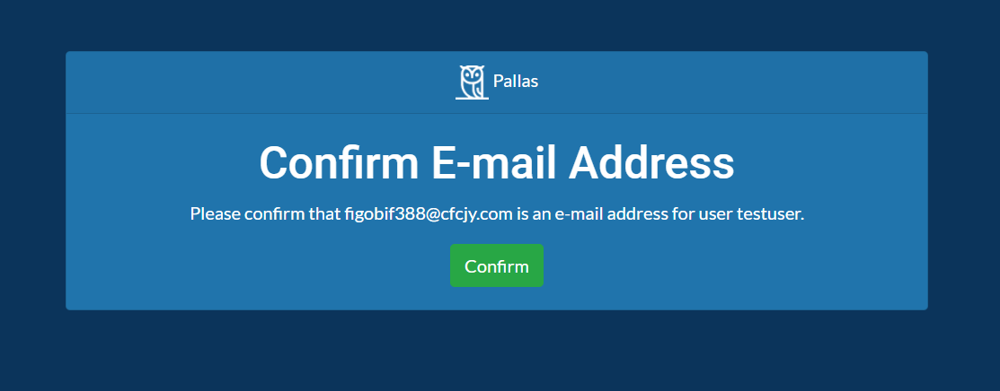

After confirming the account, I was able to login as expected.

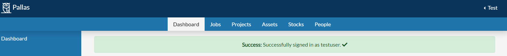

### Navigation Testing

#### Navigation Test Procedure

1. In desktop view, afer logging in, navigate to all the different apps in the site using the main navigation header, *Dashboard, Jobs, Projects, Assets, Stocks, People, Notifications*, making sure they direct to the correct page.
2. Inside each of the apps, test that all sidebar links are working and directing to the correct page
3. Test that notifications and logout links are working in the account drop left links.
4. Return to the dashboard, change to mobile navigation and verify that all links in the mobile navbar direct to the correct page.

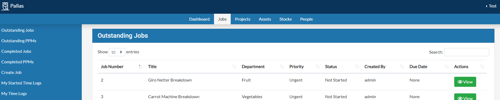

#### Navigation Test Outcome

All main nav navigation links behaved as intended.

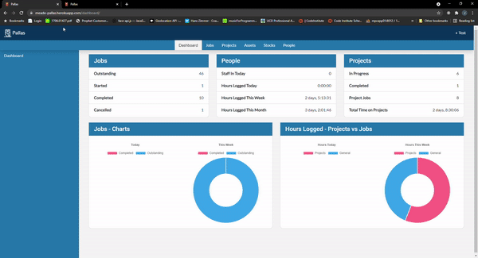

All side nav navigation links behaved as intended.

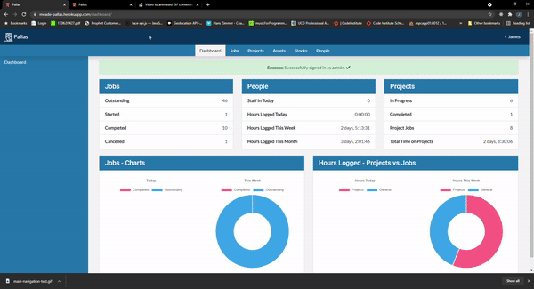

All account navigation links behaved as intended.

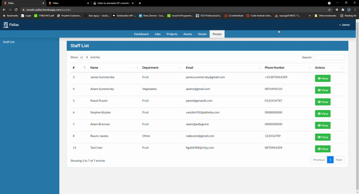

All mobile navigation behaved as intended.

**Fix:** While testing the mobile navigation I noticed a few of the tables, forms had headings that didn't line up with what they were showing. I amended those as appropriate.

##### Part 1

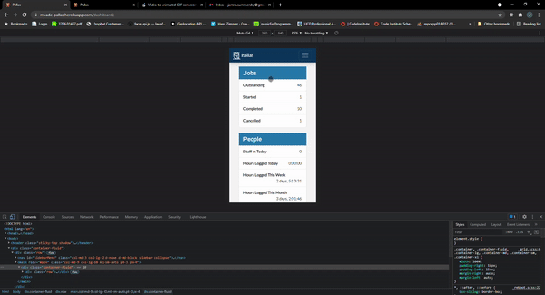

##### Part 2

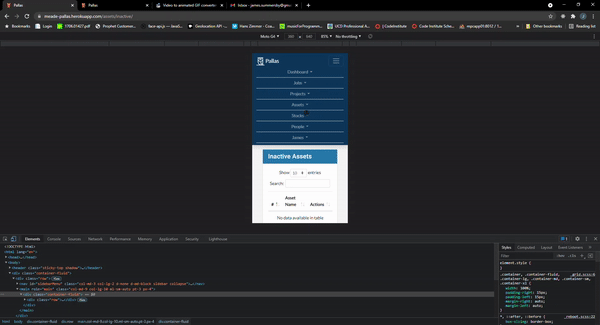

##### Part 3

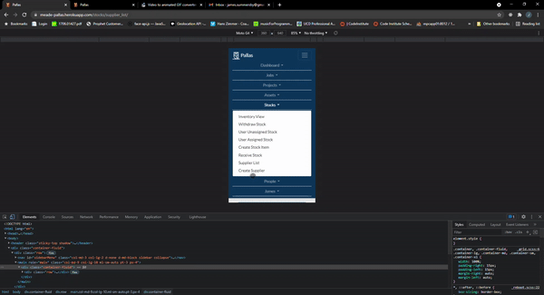

### Job Testing

#### Job Testing Procedure

1. Navigate to the *Jobs* app using the main navbar.
2. Create a new job using the *Create Job* sidebar link.
3. Fill in the form details and assign the job to the logged in user *(to verify notification works correctly)*
4. Also select a project and asset that the job relates to *(to verify links in details work correctly)*
5. Once filled out, submit the form.
6. Navigate to *Outstanding Jobs* table to make sure the job appears there. *(Use search bar to find job if there are many)*
7. Check profile icon to ensure notifications were created successfully
8. Navigate to notifications page to check that notifications are there and link correctly
9. Use link in notification to navigate to job
10. Check that links to project and asset in job details work correctly.
11. Attempt to edit job details through *Edit Job* button at bottom of job details
12. Add job steps to job
13. Test job steps buttons to check that they behave correctly
14. Complete job steps through the *Complete Job* button at bottom of job details *(this button won't appear if the job has no steps attached to it)*
15. Attempt to start a log for the job using the *Start Job* button
16. Verify that a notification was created to let you know you have started a time log
17. Navigate to the *My Started Time Logs* link and verify that your started log appears there.
18. Use the *Stop* button in the log to stop the time log
19. Navigate to the *My Time Logs* link to verify that your time log appears there.
20. Navigate to the job through the log link and manually log time using the *Log Time* button
21. Verify that both time logs appear in the *Job Times* table in the job details page.
22. Use the *Add Part* button to add parts to the job
23. Verify that the stock withdrawl form defaults the job field to the job you navigated from.
24. Submit the stock withdrawl form and navigate back to the job.
25. Ensure the stock withdrawl is visible in the *Parts Used* table in the job details
26. Use the *Cancel Job* button and verify the status of the job is updated to *Cancelled* and that the links at the bottom of the job details view have updated.
27. Use the *Reopen Job* button and verify the status of the job is updated to *In Progress* and that the links have updated
28. Use the *Mark Completed* button and verify the status of the job has updated to *Completed* and that the links have updated.
29. Navigate to the *Completed Jobs* link and verify that the job is now there.

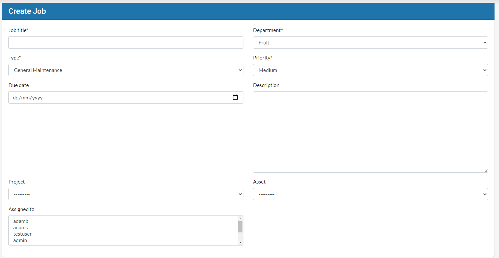

#### Job Test Outcome

All steps were performed successfully and without error.

##### Job Test Part 1

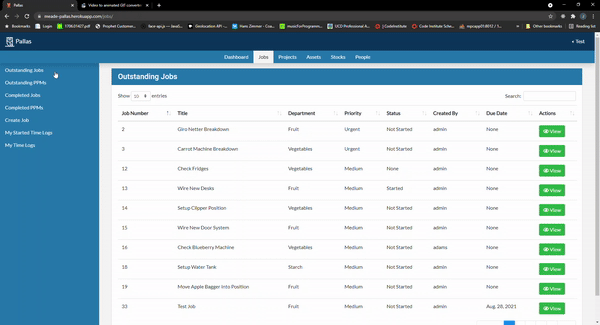

##### Job Test Part 2

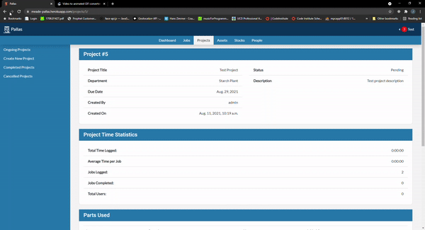

##### Job Test Part 3

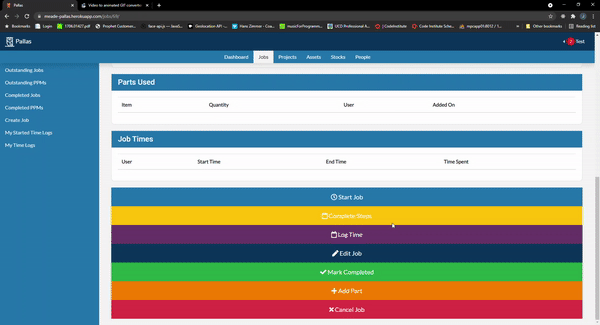

##### Job Test Part 4

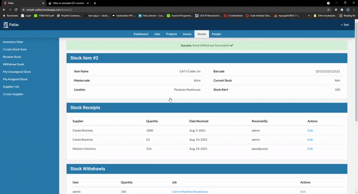

### Project Testing

#### Notes

You must be logged in as an *Admin* or *Manager* user to create projects, you will not see a link if you are not logged in as an *Admin* or *Manager* user and attempting to navigate to the *Create Project* page will prompt a redirect and error to appear.

#### Project Testing Procedure

1. Navigate to the *Projects* app in using the main nav
2. Click the *Create New Project* link in the sidenav.
3. Fill in the form and submit to create a new project.
4. On successful submission, navigate to the *Ongoing Projects* link in the sidenav
5. Verify that the project you created is in the table view. *(Use the search function if you cannot find it)*
6. Open the project you created using the *View* button.
7. At the bottom click the *Edit Project* button to edit the project
8. Amend one or more details of the project and submit the update
9. Verify that the project details have updated successfully
10. At the bottom of the project details page, use the *Create Project Job* button to create a project job.
11. Verify that the create job form that appears has selected the project you created as the default project for the job.
12. Fill in the other details for the job form and create the job.
13. Add a part to the job and log some time to it.
14. Once done, navigate back to the project details view and verify that the project jobs section shows the job you created, that the parts used section shows the parts used in the job you created and that the project time statistics have updated appropriately.
15. Use the *Mark Completed* button in the project details page and verify that the status of the project updates and that the action buttons at the bottom update accordingly.
16. Navigate to the *Completed Projects* view and verify that the project now appears there
17. Open the project again and use the *Cancel Project* button and verify that the project status updates to *Cancelled*
18. Navigate to the *Cancelled Projects* view and verify that the project is now there.

#### Project Testing Outcome

Initially when testing these features I got an internal server error related to trying to find the microseconds attribute of an int object which I resolved. I also noticed the parts used section of the project details page wasn't showing any parts which I realised was because I hadn't passed the parts to the context processor for the view.

After applying these fixes all the functionalities for this app worked as expected.

##### Project Testing Part 1

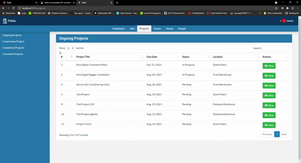

##### Project Testing Part 2

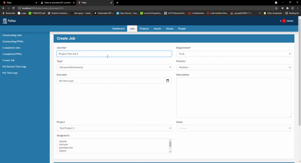

##### Project Testing Part 3

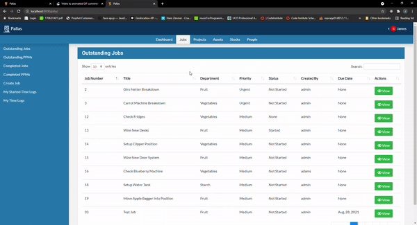

### Assets Testing

#### Assets Testing Notes

Again, you must be logged in as an *Admin* or *Manager* to test this functionality.

#### Assets Testing Procedure

1. Navigate to *Assets* app using main nav
2. Navigate to the *Create New Asset* link in the side nav
3. Fill in the form as appropriate
4. Submit the form and verify that the asset has successfully been created.
5. Navigate to the *Active Assets* view and verify that the asset is now listed there
6. Click the view button to view the asset
7. At the bottom of the *Asset Details* page click the *Edit Asset* button
8. Change some details of the asset and submit the changes
9. Verify that the asset has been updated successfully
10. At the bottom of the asset details page click *Add PPM Job*
11. Fill in the details and submit the form.
12. In the *Asset Details* page, ensure that the *PPM* is now in the scheduled PPMs section
13. In the *Jobs* section, ensure that the *PPM* job has been created successfully
14. Navigate to the *Outstanding PPMs* section in the *Jobs* app and verify that the PPM job is there
15. Click on the PPM job that was created, verify that it's due date is set to today
16. Add a part, log some time and mark the job as *Completed*
17. Go back to the *Outstanding PPMs* view and verify that a new PPM job has been created with a due date of today *(the day of completion of the previous PPM)* plus the day interval of the PPM
18. Navigate back to the asset details view
19. Verify that the parts used, jobs and time statistics have updated appropriately

#### Assets Testing Outcome

The Assets app manual tests revealed that there was a problem with the asset details view that no parts were being shown, there was also a typo on one of the form headers and there was a dead *Make Asset Inactive* link.

After applying fixes for these issues the functionalities worked as expected.

##### Assets Testing Part 1

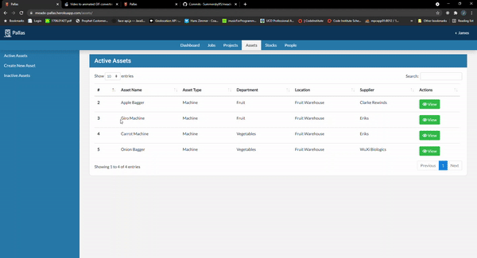

##### Assets Testing Part 2

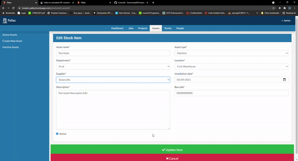

##### Assets Testing Part 3

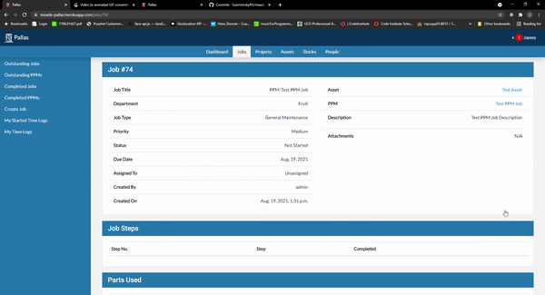

##### Assets Testing Part 4

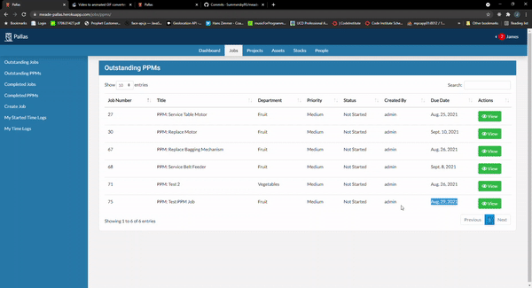

### Stocks Testing

#### Stocks Testing Notes

To use many of the functionalities in the *Stocks* app, your account must be either a *Stock Controller*, *Manager* or *Admin* account type.

#### Stocks Testing Procedure

1. Navigate to the *Stocks* app using the main nav
2. Using the side nav navigate to the *Create Supplier* form
3. Fill in the form and submit it
4. Navigate to the *Supplier List* view and verify the supplier you created is there.
5. Navigate to the *Create Stock Item* form in the side nav
6. Fill in the form and submit it
7. Navigate to the *Inventory View* and verify that your stock item now appears there
8. Navigate to the *Withdraw Stock* form and attempt to withdraw stock of your product that is greater than zero. *(Do this before you try to receive stock for the product)*
9. Verify that you get an error stating that there isn't sufficient stock for you to withdraw.
10. Navigate to the *Receive Stock* view and receive a quantity of the new item you have created
11. Verify that the current stock of the product has updated correctly
12. Use the *Withdraw Stock* form to withdraw a quantity of the item such that it is now below it's stock alert
13. Verify that the current stock of the product has updated successfully
14. Verify that you have received a notification that a stock item is below it's alert level
15. If you assigned the stock to a job verify that the transfer exists in the *My Assigned Stock* view
16. If you didn't assign the stock to a job, verify the transfer is in the *My Unassigned Stock* view
17. Attempt to edit the transfer to and verify that it updates correctly

#### Stocks Testing Outcome

All functionalities behaved as expected.

##### Stocks Testing Part 1

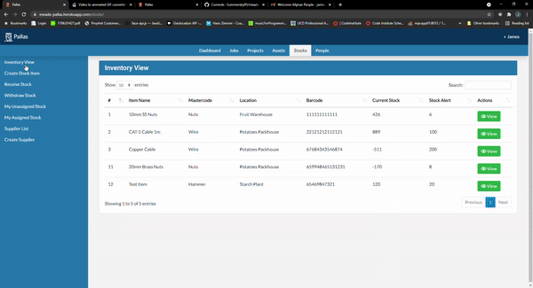

##### Stocks Testing Part 2

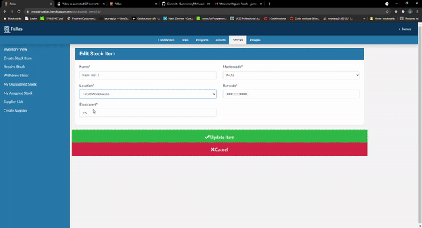

##### Stocks Testing Part 3

##### Stocks Testing Part 4

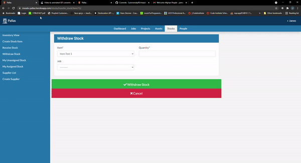

##### Stocks Testing Part 5

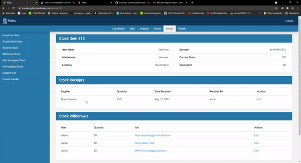

### People Testing

#### People Testing Notes

As with other apps, you must be logged in as an *Admin* or *Manager* to use it.

#### People Testing Procedure

1. Using the main nav, navigate to the *People* app
2. In the *Staff List* view, click the *View* action for an employee with a couple of jobs/time logs/parts used.
3. Verify that all information and statistics in the *Employee Profile* page behave accordingly.
4. In the *Jobs* section of the profile, use the *View All* button
5. Verify that the *Jobs* shown in the view belong to the requested user.
6. In the *Stock Withdrawls* section use the *View All* button
7. Verify that the view shows you the stock transfers for the requested user.
8. In the *Time Logs* section of the user profile, use the *View All* button
9. Verify that the view shows all the time logs for the requested user.
10. At the bottom of the user profile use the *Give Bonus* button
11. Verify that this takes you to the employee bonus form page
12. Enter a *Bonus* amount in the form field and click the *Give Bonus* button
13. Verify that this directs you to a *Stripe* payment form.
14. Fill in the card details with test card details. *(Real card info will not work as it is hooked up using a test API key)*
15. Submit the form
16. Verify the payment is authorized and that it redirects you to the bonus success page.

#### People Testing Outcome

All functionalities of the *People* app behaved as expected.

##### People Testing Part 1

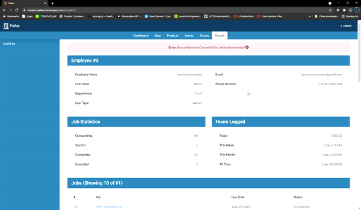

##### People Testing Part 2

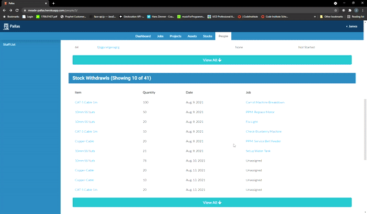

This concludes the manual testing section of the testing file. The manual testing process revealed various bugs that have been fixed and was very thorough.

## Validator Testing

### HTML Validator Testing

HTML validation was performed using the [W3C Markup Validation Service](https://validator.w3.org/)

#### HTML Validator Errors

1. **The *main* role is unnecessary on element *main*** - *Fix:* Remove *main* role from *main* elements.

Apart from that I received no validator errors.

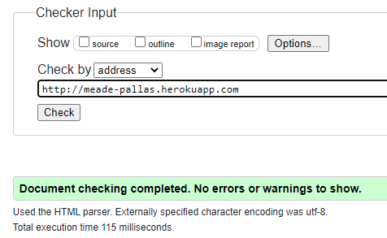

### CSS Validator Testing

CSS validation was conducted using the [W3C CSS Validation Service](https://jigsaw.w3.org/css-validator/)

### CSS Validator Errors

1. **Style rule with bad CSS rule** - *Fix:* I had a min height calculation on a class that was not valid. I removed the broken rule from the class

Putting the URL of the deployed site revealed other errors however they were all linked to the *Bootstrap* style sheets and so was unable to fix them.

Running my style sheet through direct input, I received warnings about unknown vendor extensions for my *root variables* that set the colours but I didn't want to explicitly replace the root variable with the explicit colour everywhere it was used and so ignored it.

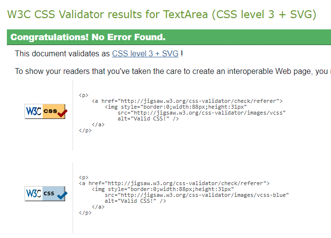

### JavaScript Validation Testing

I used Visual Studio Code to develop this application and installed the [JSHint](https://jshint.com/) extension in VSCode which notified me of JS errors during development which I fixed as and when they occured.

### Python Validation Testing

In VS Code, I used the [pycodestyle](https://pypi.org/project/pycodestyle/) extension to highlight linting and formatting errors in python while coding. This enforced the [PEP8](https://www.python.org/dev/peps/pep-0008/) python style guide on my Python code and kept the code clean and readable.

## Responsiveness Testing

To test responsiveness, I reperformed the entire manual testing procedures described above on different screen sizes to verify that the site responded correctly.

### Responsiveness Bugs

**Steps Form Controls Taking Up Too Much Space On Mobile** - *Fix:* Add *d-none d-md-table-cell* classes to steps controls to hide them on mobile devices. This was necessary because the controls took up too much space in the row and the input text couldn't be seen otherwise.

#### Responsive Testing Part 1

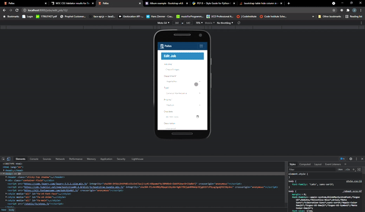

#### Responsive Testing Part 2

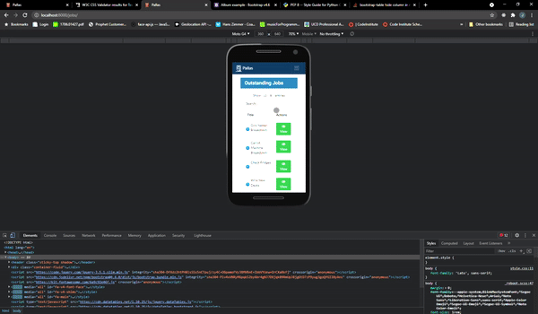

